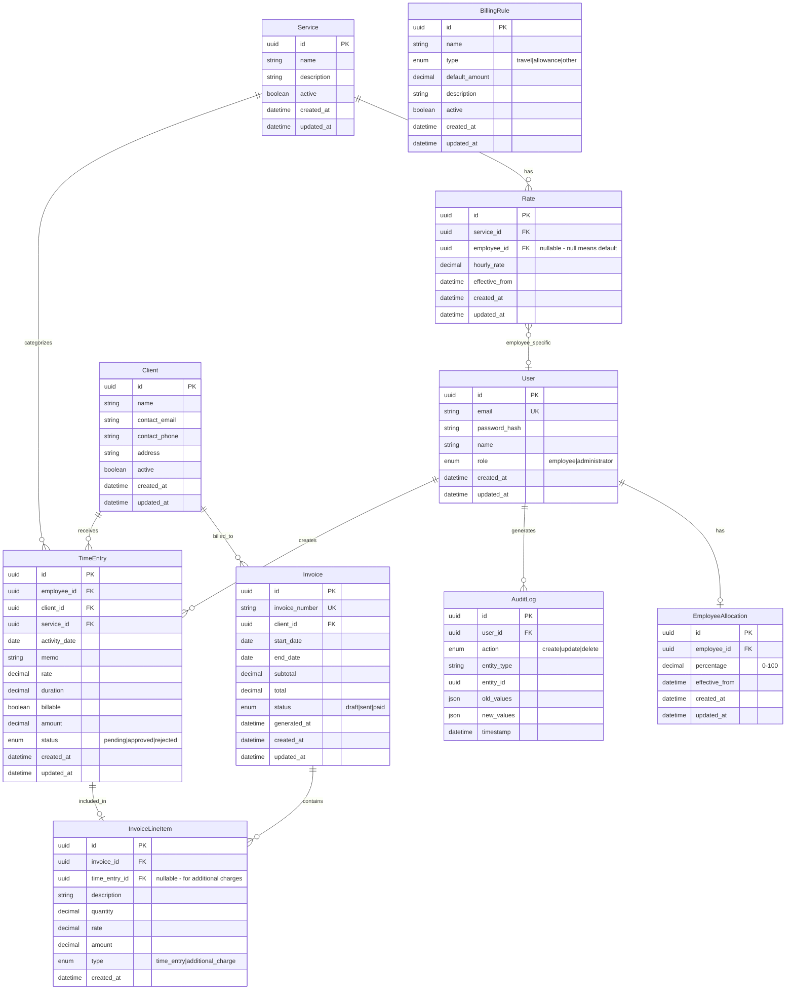

# Design Document: Time Tracking and Invoicing System

## Overview

The Time Tracking and Invoicing System is a full-stack web application that enables consulting/HR services companies to manage employee time tracking, client billing, and payroll calculations. The system replaces manual Excel-based workflows with an automated, role-based platform supporting two user types: Employees (time entry and personal timesheet management) and Administrators (full system access including invoicing, reporting, and configuration).

The application follows a modern three-tier architecture with a React frontend, Node.js/Express backend API, and PostgreSQL database. Key features include real-time amount calculations, PDF invoice generation, Excel exports, email notifications, and comprehensive audit logging.

## Architecture


### Technology Stack

| Layer | Technology | Rationale |
|-------|------------|-----------|
| Frontend | React 18 + TypeScript | Type safety, component reusability, large ecosystem |
| State Management | React Query + Zustand | Server state caching, minimal client state |
| UI Framework | Tailwind CSS + shadcn/ui | Responsive design, accessible components |
| Backend | Node.js + Express | JavaScript ecosystem consistency, async I/O |
| ORM | Prisma | Type-safe database access, migrations |
| Database | PostgreSQL | ACID compliance, JSON support, reliability |
| Authentication | JWT + bcrypt | Stateless auth, secure password hashing |
| PDF Generation | PDFKit | Programmatic PDF creation |
| Excel Export | ExcelJS | Full Excel file generation |
| Email | SendGrid | Reliable email delivery API |
| Testing | Vitest + fast-check | Unit testing with property-based testing support |

## Components and Interfaces

### Frontend Components


### Backend API Interfaces

#### Authentication API
```typescript
interface AuthAPI {
  POST /api/auth/login: (credentials: LoginRequest) => AuthResponse
  POST /api/auth/logout: () => void
  GET /api/auth/me: () => UserProfile
}

interface LoginRequest {
  email: string;
  password: string;
}

interface AuthResponse {
  token: string;
  user: UserProfile;
}

interface UserProfile {
  id: string;
  email: string;
  name: string;
  role: 'employee' | 'administrator';
}
```

#### Time Entry API
```typescript
interface TimeEntryAPI {
  GET /api/time-entries: (filters?: TimeEntryFilters) => TimeEntry[]
  GET /api/time-entries/:id: (id: string) => TimeEntry
  POST /api/time-entries: (entry: CreateTimeEntryRequest) => TimeEntry
  PUT /api/time-entries/:id: (id: string, entry: UpdateTimeEntryRequest) => TimeEntry
  DELETE /api/time-entries/:id: (id: string) => void
  GET /api/time-entries/export: (filters?: TimeEntryFilters) => ExcelFile
}

interface TimeEntryFilters {
  employeeId?: string;
  clientId?: string;
  startDate?: Date;
  endDate?: Date;
  billable?: boolean;
}

interface CreateTimeEntryRequest {
  activityDate: Date;
  clientId: string;
  serviceId: string;
  memo: string;
  rate: number;
  duration: number;
  billable: boolean;
}
```

#### Invoice API
```typescript
interface InvoiceAPI {
  GET /api/invoices: (filters?: InvoiceFilters) => Invoice[]
  GET /api/invoices/:id: (id: string) => Invoice
  POST /api/invoices/generate: (request: GenerateInvoiceRequest) => Invoice
  PUT /api/invoices/:id: (id: string, updates: UpdateInvoiceRequest) => Invoice
  GET /api/invoices/:id/pdf: (id: string) => PDFFile
}

interface GenerateInvoiceRequest {
  clientId: string;
  startDate: Date;
  endDate: Date;
  additionalCharges?: AdditionalCharge[];
}

interface AdditionalCharge {
  description: string;
  amount: number;
}
```

#### Client & Rate API
```typescript
interface ClientAPI {
  GET /api/clients: () => Client[]
  GET /api/clients/:id: (id: string) => Client
  POST /api/clients: (client: CreateClientRequest) => Client
  PUT /api/clients/:id: (id: string, client: UpdateClientRequest) => Client
}

interface RateAPI {
  GET /api/rates: () => Rate[]
  GET /api/rates/service/:serviceId: (serviceId: string) => Rate
  POST /api/rates: (rate: CreateRateRequest) => Rate
  PUT /api/rates/:id: (id: string, rate: UpdateRateRequest) => Rate
}

interface ServiceAPI {
  GET /api/services: () => Service[]
  POST /api/services: (service: CreateServiceRequest) => Service
  PUT /api/services/:id: (id: string, service: UpdateServiceRequest) => Service
}
```

#### Payroll & Commission API
```typescript
interface PayrollAPI {
  GET /api/payroll/breakdown: (filters: PayrollFilters) => PayrollBreakdown[]
  GET /api/payroll/commission: (filters: PayrollFilters) => CommissionReport[]
  PUT /api/payroll/allocation/:employeeId: (employeeId: string, allocation: AllocationUpdate) => void
}

interface PayrollFilters {
  employeeId?: string;
  clientId?: string;
  startDate: Date;
  endDate: Date;
}

interface AllocationUpdate {
  percentage: number; // 0-100
}
```

#### Reports API
```typescript
interface ReportsAPI {
  GET /api/reports/hours-by-client: (filters: ReportFilters) => HoursByClientReport
  GET /api/reports/revenue-by-consultant: (filters: ReportFilters) => RevenueByConsultantReport
  GET /api/reports/summary: (filters: ReportFilters) => SummaryReport
}
```

#### Audit Log API
```typescript
interface AuditLogAPI {
  GET /api/audit-logs: (filters?: AuditLogFilters) => AuditLogEntry[]
}

interface AuditLogFilters {
  userId?: string;
  actionType?: 'create' | 'update' | 'delete';
  entityType?: string;
  startDate?: Date;
  endDate?: Date;
}
```

### Service Layer Interfaces

```typescript
interface TimeEntryService {
  createEntry(userId: string, data: CreateTimeEntryRequest): Promise<TimeEntry>;
  updateEntry(userId: string, entryId: string, data: UpdateTimeEntryRequest): Promise<TimeEntry>;
  deleteEntry(userId: string, entryId: string): Promise<void>;
  getEntriesForUser(userId: string, filters?: TimeEntryFilters): Promise<TimeEntry[]>;
  getAllEntries(filters?: TimeEntryFilters): Promise<TimeEntry[]>;
  canModifyEntry(userId: string, entry: TimeEntry): boolean;
  calculateAmount(rate: number, duration: number, billable: boolean): number;
}

interface InvoiceService {
  generateInvoice(request: GenerateInvoiceRequest): Promise<Invoice>;
  addAdditionalCharge(invoiceId: string, charge: AdditionalCharge): Promise<Invoice>;
  generatePDF(invoiceId: string): Promise<Buffer>;
  getNextInvoiceNumber(): Promise<string>;
}

interface CommissionService {
  calculateCommission(employeeId: string, billableAmount: number): number;
  getCommissionReport(filters: PayrollFilters): Promise<CommissionReport[]>;
  setAllocationPercentage(employeeId: string, percentage: number): Promise<void>;
}

interface RateService {
  getEffectiveRate(serviceId: string, employeeId?: string): Promise<number>;
  setDefaultRate(serviceId: string, rate: number): Promise<void>;
  setEmployeeRate(serviceId: string, employeeId: string, rate: number): Promise<void>;
}

interface AuditService {
  log(entry: CreateAuditLogEntry): Promise<void>;
  query(filters: AuditLogFilters): Promise<AuditLogEntry[]>;
}

interface NotificationService {
  sendTimeEntrySubmittedNotification(entry: TimeEntry): Promise<void>;
  sendTimeEntryApprovedNotification(entry: TimeEntry, approved: boolean): Promise<void>;
  sendInvoiceGeneratedNotification(invoice: Invoice): Promise<void>;
}
```

## Data Models



### TypeScript Data Models

```typescript
interface User {
  id: string;
  email: string;
  name: string;
  role: 'employee' | 'administrator';
  createdAt: Date;
  updatedAt: Date;
}

interface TimeEntry {
  id: string;
  employeeId: string;
  clientId: string;
  serviceId: string;
  activityDate: Date;
  memo: string;
  rate: number;
  duration: number;
  billable: boolean;
  amount: number;
  status: 'pending' | 'approved' | 'rejected';
  createdAt: Date;
  updatedAt: Date;
}

interface Client {
  id: string;
  name: string;
  contactEmail: string;
  contactPhone: string;
  address: string;
  active: boolean;
  createdAt: Date;
  updatedAt: Date;
}

interface Service {
  id: string;
  name: string;
  description: string;
  active: boolean;
  createdAt: Date;
  updatedAt: Date;
}

interface Rate {
  id: string;
  serviceId: string;
  employeeId: string | null;
  hourlyRate: number;
  effectiveFrom: Date;
  createdAt: Date;
  updatedAt: Date;
}

interface Invoice {
  id: string;
  invoiceNumber: string;
  clientId: string;
  startDate: Date;
  endDate: Date;
  subtotal: number;
  total: number;
  status: 'draft' | 'sent' | 'paid';
  generatedAt: Date;
  lineItems: InvoiceLineItem[];
  createdAt: Date;
  updatedAt: Date;
}

interface InvoiceLineItem {
  id: string;
  invoiceId: string;
  timeEntryId: string | null;
  description: string;
  quantity: number;
  rate: number;
  amount: number;
  type: 'time_entry' | 'additional_charge';
  createdAt: Date;
}

interface EmployeeAllocation {
  id: string;
  employeeId: string;
  percentage: number;
  effectiveFrom: Date;
  createdAt: Date;
  updatedAt: Date;
}

interface AuditLogEntry {
  id: string;
  userId: string;
  action: 'create' | 'update' | 'delete';
  entityType: string;
  entityId: string;
  oldValues: Record<string, unknown> | null;
  newValues: Record<string, unknown> | null;
  timestamp: Date;
}
```


## Correctness Properties

*A property is a characteristic or behavior that should hold true across all valid executions of a system-essentially, a formal statement about what the system should do. Properties serve as the bridge between human-readable specifications and machine-verifiable correctness guarantees.*

### Property 1: Amount Calculation Correctness

*For any* time entry with a rate and duration, when billable is true, the calculated amount SHALL equal rate multiplied by duration; when billable is false, the amount SHALL be zero.

**Validates: Requirements 1.6, 1.7**

### Property 2: Duration Validation

*For any* duration input value, the validation function SHALL accept the value if and only if it is a positive numeric value not exceeding 24.

**Validates: Requirements 1.5, 14.2**

### Property 3: Rate Validation

*For any* rate input value, the validation function SHALL accept the value if and only if it is a positive numeric value.

**Validates: Requirements 14.1**

### Property 4: Date Validation

*For any* date input, the validation function SHALL accept the value if and only if it represents a valid calendar date not more than 30 days in the past.

**Validates: Requirements 1.2, 14.3**

### Property 5: Employee Timesheet Filtering

*For any* employee and any combination of filters (date range, client, billable status), all returned time entries SHALL belong to that employee AND satisfy all applied filter criteria.

**Validates: Requirements 2.1, 2.2, 2.3, 2.4**

### Property 6: Admin Time Logs Filtering

*For any* combination of filters (employee, client, date range, billable status), all returned time entries SHALL satisfy all applied filter criteria simultaneously.

**Validates: Requirements 5.1, 5.2**

### Property 7: Edit Window Enforcement

*For any* time entry and any edit attempt, the system SHALL allow the edit if and only if the entry was created within 24 hours of the current time AND the user owns the entry.

**Validates: Requirements 3.1, 3.2**

### Property 8: Delete Window Enforcement

*For any* time entry and any delete attempt, the system SHALL allow the deletion if and only if the entry was created within 24 hours of the current time AND the user owns the entry.

**Validates: Requirements 3.3, 3.4**

### Property 9: Service Rate Auto-Fill

*For any* service selection, the auto-filled rate SHALL equal the employee-specific rate if one exists, otherwise the default service rate.

**Validates: Requirements 1.4, 8.3, 8.4**

### Property 10: Invoice Aggregation Correctness

*For any* client and date range, the generated invoice SHALL include exactly all billable time entries for that client within that date range, with line item amounts matching the original entry amounts.

**Validates: Requirements 6.1, 6.2**

### Property 11: Invoice Number Uniqueness

*For any* set of generated invoices, all invoice numbers SHALL be unique.

**Validates: Requirements 6.5**

### Property 12: Commission Calculation

*For any* employee with an allocation percentage and billable amount, the calculated commission SHALL equal the billable amount multiplied by the allocation percentage divided by 100.

**Validates: Requirements 7.3**

### Property 13: Allocation Percentage Validation

*For any* allocation percentage input, the system SHALL accept the value if and only if it is between 0 and 100 inclusive.

**Validates: Requirements 7.2**

### Property 14: Hours Aggregation by Employee

*For any* set of time entries, the total hours per employee SHALL equal the sum of duration values for all entries belonging to that employee.

**Validates: Requirements 4.1, 7.1**

### Property 15: Billable vs Non-Billable Breakdown

*For any* set of time entries, the billable hours total SHALL equal the sum of durations where billable is true, and non-billable hours SHALL equal the sum where billable is false.

**Validates: Requirements 4.2**

### Property 16: Hours by Client Report

*For any* date range, the hours-by-client report SHALL show totals that equal the sum of durations grouped by client for entries within that range.

**Validates: Requirements 9.1**

### Property 17: Revenue by Consultant Report

*For any* date range, the revenue-by-consultant report SHALL show totals that equal the sum of billable amounts grouped by employee for entries within that range.

**Validates: Requirements 9.2**

### Property 18: Role-Based Access Control

*For any* authenticated user and any protected endpoint, access SHALL be granted if and only if the user's role has permission for that endpoint.

**Validates: Requirements 10.3, 10.4**

### Property 19: Password Storage Security

*For any* stored user credential, the stored password hash SHALL not equal the plaintext password.

**Validates: Requirements 10.5**

### Property 20: Audit Log Completeness

*For any* create, update, or delete operation on time entries, clients, or rates, an audit log entry SHALL be created containing the user ID, action type, entity type, entity ID, timestamp, and changed values.

**Validates: Requirements 11.1, 11.2**

### Property 21: Audit Log Filtering

*For any* audit log query with filters (date range, user, action type), all returned entries SHALL satisfy all applied filter criteria.

**Validates: Requirements 11.3**

### Property 22: Excel Export Round-Trip

*For any* set of filtered time entries, exporting to Excel and parsing the result SHALL yield data equivalent to the original filtered entries.

**Validates: Requirements 5.3**

### Property 23: Time Entry Persistence

*For any* valid time entry submission, querying the database immediately after SHALL return the entry with status 'pending'.

**Validates: Requirements 1.8**

### Property 24: Client CRUD Consistency

*For any* client creation or update operation, querying the client immediately after SHALL return the client with the provided/updated values.

**Validates: Requirements 8.1, 8.2**

### Property 25: Form Validation Error Specificity

*For any* form submission with one or more invalid fields, the system SHALL return error messages that identify each specific invalid field.

**Validates: Requirements 14.4**

## Error Handling

### Client-Side Error Handling

| Error Type | Handling Strategy |
|------------|-------------------|
| Validation Errors | Display inline error messages next to invalid fields; prevent form submission |
| Network Errors | Show toast notification with retry option; cache unsaved data locally |
| Authentication Errors | Redirect to login page; clear stored tokens |
| Authorization Errors | Display "Access Denied" message; log attempt for security review |
| Server Errors (5xx) | Show generic error message; log details for debugging |

### Server-Side Error Handling

```typescript
interface ApiError {
  code: string;
  message: string;
  details?: Record<string, string[]>;
  timestamp: Date;
  requestId: string;
}

// Error codes
enum ErrorCode {
  VALIDATION_ERROR = 'VALIDATION_ERROR',
  AUTHENTICATION_REQUIRED = 'AUTHENTICATION_REQUIRED',
  AUTHORIZATION_DENIED = 'AUTHORIZATION_DENIED',
  RESOURCE_NOT_FOUND = 'RESOURCE_NOT_FOUND',
  MODIFICATION_WINDOW_EXPIRED = 'MODIFICATION_WINDOW_EXPIRED',
  DUPLICATE_ENTRY = 'DUPLICATE_ENTRY',
  INTERNAL_ERROR = 'INTERNAL_ERROR',
}
```

### Error Response Examples

```json
// Validation Error
{
  "code": "VALIDATION_ERROR",
  "message": "Invalid input data",
  "details": {
    "duration": ["Duration must be a positive number not exceeding 24"],
    "rate": ["Rate must be a positive number"]
  },
  "timestamp": "2025-12-11T10:30:00Z",
  "requestId": "req_abc123"
}

// Modification Window Expired
{
  "code": "MODIFICATION_WINDOW_EXPIRED",
  "message": "Time entry can no longer be modified. Edit window (24 hours) has expired.",
  "timestamp": "2025-12-11T10:30:00Z",
  "requestId": "req_def456"
}
```

### Database Error Handling

- Use transactions for multi-step operations (invoice generation, bulk updates)
- Implement retry logic for transient failures (connection timeouts)
- Log all database errors with query context for debugging
- Return user-friendly messages without exposing internal details

## Testing Strategy

### Dual Testing Approach

This system employs both unit testing and property-based testing to ensure comprehensive coverage:

- **Unit Tests**: Verify specific examples, edge cases, and integration points
- **Property-Based Tests**: Verify universal properties that should hold across all valid inputs

### Testing Framework

- **Test Runner**: Vitest
- **Property-Based Testing**: fast-check
- **API Testing**: Supertest
- **Mocking**: Vitest built-in mocking

### Unit Testing Strategy

| Component | Test Focus |
|-----------|------------|
| Validators | Boundary values, invalid inputs, edge cases |
| Services | Business logic, error conditions, state transitions |
| Controllers | Request/response handling, error mapping |
| API Routes | Authentication, authorization, input validation |

### Property-Based Testing Strategy

Each correctness property from the design document will be implemented as a property-based test using fast-check. Tests will:

1. Generate random valid inputs using fast-check arbitraries
2. Execute the system under test
3. Assert the property holds for all generated inputs
4. Run minimum 100 iterations per property

**Property Test Annotation Format:**
```typescript
// **Feature: time-tracking-invoicing, Property 1: Amount Calculation Correctness**
// **Validates: Requirements 1.6, 1.7**
test.prop([fc.float(), fc.float(), fc.boolean()], (rate, duration, billable) => {
  // Test implementation
});
```

### Test Categories

1. **Validation Properties** (Properties 2, 3, 4, 13, 25)
   - Test input validation functions with generated inputs
   - Verify acceptance/rejection criteria

2. **Calculation Properties** (Properties 1, 12, 14, 15, 16, 17)
   - Test mathematical calculations with generated numbers
   - Verify calculation accuracy

3. **Filtering Properties** (Properties 5, 6, 21)
   - Generate random data sets and filter criteria
   - Verify all results match filter conditions

4. **Access Control Properties** (Properties 7, 8, 18)
   - Generate users, entries, and timestamps
   - Verify access decisions are correct

5. **Data Integrity Properties** (Properties 10, 11, 20, 22, 23, 24)
   - Test CRUD operations and data consistency
   - Verify round-trip data preservation

### Test Coverage Goals

- Unit test coverage: 80% line coverage minimum
- Property tests: All 25 correctness properties implemented
- Integration tests: All API endpoints covered
- E2E tests: Critical user workflows (time entry, invoice generation)
